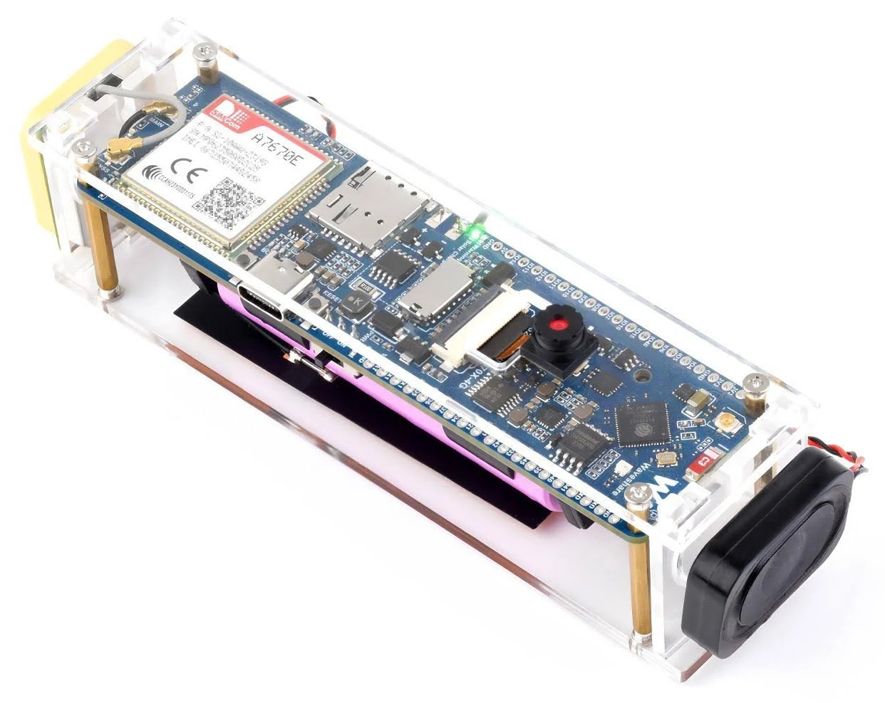

# Winni GPS Tracker — ESP32-S3 (Waveshare) + A7670E  
**Modulares PlatformIO-Projekt für Wohnmobile, Wohnwagen und Fahrzeuge ohne Abo**


Der Winni GPS Tracker ist ein eigenständiger, Cloud-freier Fahrzeug-Tracker auf Basis des **ESP32-S3-A7670E-4G** Moduls.  
Er nutzt eine **Daten-SIM-Karte** (keine SMS notwendig) und sendet Positionsdaten über das Mobilfunknetz an einen **Telegram-Bot**.  
Optional kann eine **18650 Li-Ion-Batterie** angeschlossen werden, um das System autark zu betreiben.

Benötigt wird eine Telegram Account um die Verbindung zum Winni GPS Tracker herzustellen.

---

## ⚙️ Hardwareanforderungen


- **ESP32-S3-A7670E-4G Modul (Waveshare)** (https://www.waveshare.com/wiki/ESP32-S3-A7670E-4G)  
- **Nano-SIM Karte mit Datentarif**  
- **Optional:**  
  - 18650 Li-Ion-Akku  
  - Externes **NEO-6M GPS-Modul** (empfohlen)  
    > Das interne GNSS-Modul teilt sich die Leitung mit dem LTE-Modem.  
    > Daher ist gleichzeitiges Empfangen von GPS-Daten und Telegram-Kommunikation nicht möglich.

---

## 💬 Telegram-Befehle

| Befehl | Beschreibung |
|:-------|:--------------|
| `/info` | Zeigt die aktuelle Signalstärke der Mobilfunkverbindung. |
| `/gps`  | Ermittelt zunächst eine ungefähre Position über LTE und versucht anschließend, einen GNSS-Fix zu erhalten. |

---

## 🧩 Geplante Erweiterungen (TODO)

- Geofencing (Benachrichtigung bei Verlassen eines definierten Bereichs)  
- Speicherung von Standortdaten auf SD-Karte  
- Aufnahme und Versand eines Kamerabilds  

---

## 🔧 Konfiguration

Vor der ersten Nutzung muss die Datei **`example_config.h`** kopiert und angepasst werden.

1. Kopiere:
   ```bash
   cp src/example_config.h src/config.h
